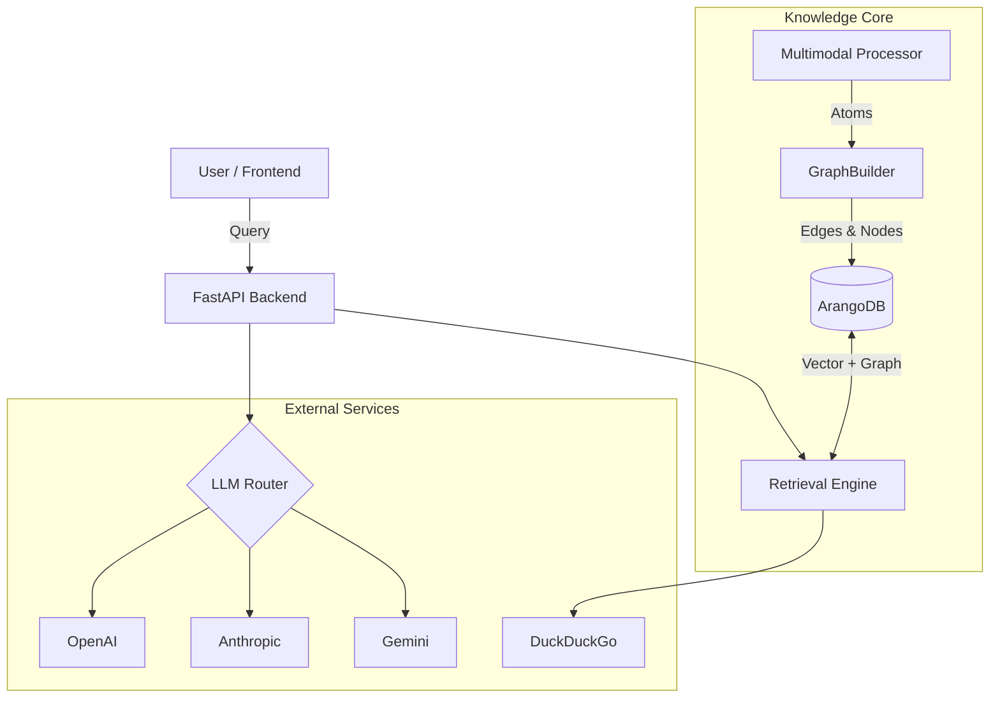

# 🧠 Albot: Advanced Multimodal RAG System


> **state-of-the-art multimodal retrieval-augmented generation (RAG) system** capable of processing text, audio, video, and images to generate context-aware responses with citations. Built with a focus on graph-based retrieval, multi-resolution embeddings, and adaptive reasoning.

---

## 📚 Table of Contents

- [Features](#-features)
- [System Architecture](#-system-architecture)
- [Tech Stack](#-tech-stack)
- [Prerequisites](#-prerequisites)
- [Installation](#-installation)
  - [Docker (Recommended)](#docker-recommended)
  - [Manual Setup](#manual-setup)
- [Configuration](#-configuration)
- [Usage Guide](#-usage-guide)
- [API Reference](#-api-reference)
- [Project Structure](#-project-structure)
- [Troubleshooting](#-troubleshooting)
- [Roadmap](#-roadmap)
- [License](#-license)

---

## 🌟 Features

### 🧠 Core Intelligence

- **Multimodal Ingestion**: Seamlessly process Text (.txt, .pdf), Images (OCR + VLM), Audio (Whisper), Video (Frame extraction + Transcription), and Structured Data (CSV/Excel).
- **Hybrid Retrieval Engine**: Combines **Vector Similarity** (Semantic), **Graph Traversal** (Relational), and **BM25** (Lexical) for exhaustive search coverage.
- **Adaptive Reasoning**: Implements **Personalized PageRank (PPR)** and **Bayesian Weight Optimization** to dynamically adjust retrieval strategies based on query complexity.
- **Multi-LLM Routing**: Smart router supports OpenAI, Anthropic, Gemini, Groq, and OpenRouter with automatic fallback and rate limit handling.

### 💾 Memory & Persistence

- **Unified Knowledge Graph**: Stores entities and relationships in ArangoDB, linking cross-modal concepts (e.g., linking a video frame to a text paragraph).
- **Persistent Conversation History**: Chat history is reliably stored in **SQLite**, ensuring context is preserved across page reloads and browser sessions.
- **"Clear Chat" Functionality**: User-controlled session management to reset context when needed.

### 🌐 Connectivity

- **Integrated Web Search**: Falls back to live web search (DuckDuckGo) for real-time information retrieval when internal knowledge is insufficient.
- **Real-time Streaming**: Token-by-token streaming responses for a responsive user experience.

### 🛡️ Deployment

- **Docker-First Architecture**: Fully containerized backend and database for consistent deployment.
- **Zero-Infrastructure Cost**: Designed to run locally or on commodity hardware using user-provided API keys.

---

## 🏗 System Architecture

The system follows a microservices-inspired modular architecture:



---

## 💻 Tech Stack

### Backend

| Component            | Technology             | Description                                     |
| -------------------- | ---------------------- | ----------------------------------------------- |
| **Framework**        | FastAPI                | High-performance async API                      |
| **Database**         | ArangoDB               | Multi-model (Graph + Document + Search)         |
| **Chat Storage**     | SQLite                 | Lightweight, file-based persistence for history |
| **Vector Search**    | PyTorch + Transformers | E5-Large embeddings                             |
| **Graph Algorithms** | NetworkX               | Centrality, PageRank, Community Detection       |
| **Audio/Video**      | Whisper, MoviePy       | SOTA transcription and media processing         |
| **Web Search**       | DuckDuckGo             | Private, non-tracking web search                |
| **Task Queue**       | AsyncIO                | Non-blocking concurrency                        |

### Frontend

| Component       | Technology     | Description                    |
| --------------- | -------------- | ------------------------------ |
| **Framework**   | Next.js 16     | React framework for production |
| **UI Library**  | React 19       | Latest React features          |
| **Styling**     | Tailwind CSS 4 | Utility-first CSS              |
| **Icons**       | Lucide React   | Clean, consistent iconography  |
| **HTTP Client** | Axios          | Robust data fetching           |
| **Animations**  | Framer Motion  | Smooth UI transitions          |

---

## 📋 Prerequisites

Before you begin, ensure you have the following installed:

- **Docker** & **Docker Compose** (Recommended for easiest setup)
- **Python 3.10+** (For manual backend setup)
- **Node.js 18+** & **npm** (For manual frontend setup)
- **Git**

---

## 🚀 Installation

### Docker (Recommended)

The easiest way to get the system running is via Docker Compose.

1.  **Clone the repository**

    ```bash
    git clone https://github.com/yourusername/multimodal-rag-system.git
    cd multimodal-rag-system
    ```

2.  **Start the services**

    ```bash
    docker-compose up -d --build
    ```

    _This will start ArangoDB on port 8529 and the Backend API on port 8010._

3.  **Start the Frontend** (If not included in docker-compose)
    ```bash
    cd frontend
    npm install
    npm run dev
    ```
    _The frontend will be available at `http://localhost:3000`._

### Manual Setup

#### 1. Database (ArangoDB)

Run ArangoDB using Docker:

```bash
docker run -d -p 8529:8529 -e ARANGO_ROOT_PASSWORD=rootpassword --name arangodb arangodb:latest
```

#### 2. Backend

```bash
cd backend
python -m venv venv
source venv/bin/activate  # or venv\Scripts\activate on Windows
pip install -r ../requirements.txt
python -m spacy download en_core_web_sm
python main.py
```

#### 3. Frontend

```bash
cd frontend
npm install
npm run dev
```

---

## ⚙ Configuration

Create a `.env` file in the `backend` directory (or map environment variables in `docker-compose.yml`).

```ini
# Database Configuration
ARANGO_HOST=localhost
ARANGO_PORT=8529
ARANGO_USERNAME=root
ARANGO_PASSWORD=rootpassword
ARANGO_DATABASE=multimodal_rag

# General Settings
LOG_LEVEL=INFO
UPLOAD_DIR=./data/uploads
```

_Note: API Keys for LLMs (OpenAI, Gemini, etc.) are managed via the Frontend UI for security and are stored locally in the browser/session._

---

## 📖 Usage Guide

1.  **Ingest Knowledge**:
    - Click **"Ingest Knowledge"** in the sidebar.
    - Upload files (PDF, Images, MP4, CSV) or enter a URL.
    - The system will process, chunks, embed, and link the content into the Knowledge Graph.

2.  **Chat & Query**:
    - Select **"Fast RAG"** (Speed focused) or **"Advanced RAG"** (Deep reasoning).
    - Type your query. The system will retrieve relevant context from your documents and the web.
    - View citations and source links in the response footer.

3.  **Manage Conversations**:
    - Your chat history is saved automatically.
    - Click **"Clear Chat"** to wipe the current conversation context and start fresh.

---

## 🔌 API Reference

The backend exposes a comprehensive REST API (documented via Swagger at `http://localhost:8010/docs`).

- `POST /query`: Semantic search and answer generation.
- `POST /ingest/file`: Upload and process a file.
- `POST /ingest/url`: Scrape and process a webpage.
- `GET /history`: Retrieve conversation history.
- `DELETE /history`: Clear conversation history.
- `GET /statistics`: View system performance metrics.

---

## 📂 Project Structure

```bash
multimodal-rag-system/
├── backend/                # FastAPI Application
│   ├── core/               # Business Logic
│   │   ├── ingestion/      # Multi-format parsers
│   │   ├── vectorization/  # Embedding models
│   │   ├── graph/          # Graph construction algorithms
│   │   ├── retrieval/      # Hybrid search engine
│   │   ├── web_search/     # DuckDuckGo integration
│   │   └── storage/        # ArangoDB interface
│   ├── models/             # Pydantic schemas
│   └── main.py             # Entry point
├── frontend/               # Next.js Application
│   ├── app/                # App Router pages
│   ├── components/         # Reusable UI components
│   └── lib/                # API clients and utils
├── data/                   # Local storage for DB & uploads
├── docker-compose.yml      # Container orchestration
└── requirements.txt        # Python dependencies
```

---

## 🔧 Troubleshooting

### Persistence Issues

If chat history is not saving or loading correctly, the database state might be inconsistent from previous versions.
**Fix**: Reset the Docker volumes to initialize the correct schema.

```bash
docker-compose down -v
docker-compose up --build
```

### Installation Errors

- **"Module not found"**: Ensure you have activated the virtual environment before running the backend.
- **"Connection Refused"**: Check if ArangoDB is running on port 8529.

---

## 🗺 Roadmap

- [ ] **Multi-User Support**: User authentication and private knowledge bases.
- [ ] **Advanced Visualization**: Interactive 3D graph explorer for stored knowledge.
- [ ] **Agentic Capabilities**: Autonomous web browsing and complex task execution.
- [ ] **Voice Mode**: Real-time voice-to-voice interaction.

---

## 📜 License

This project is licensed under the MIT License - see the `LICENSE` file for details.

---

<p align="center">
  Made with ❤️ by the Albot Team
</p>
